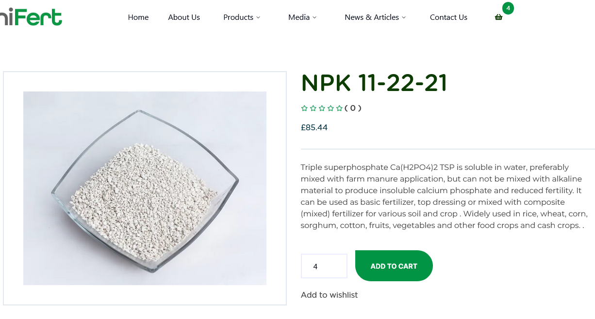
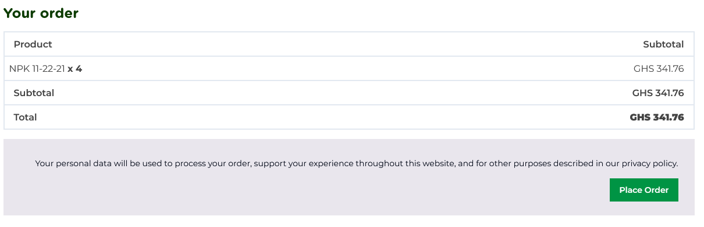

# Omnifert - Fertilizers For The Future

This is a website for Omnifert, a Ghanaian company focused on providing indigenous fertilizers to farmers, both affordable and sustainable for the environment.

Figma file: [Omnifert - Maurri Koné](https://www.figma.com/community/file/1343772653956159846)

## Table of Contents

- [Overview](#overview)
  - [The Problem](#the-problem)
  - [Features](#features)
- [Built With](#built-with)
- [Useful Resources](#useful-resources)

## Overview

The purpose of this project is to recreate the designs of the Figma file as a working webpage as closely as possible.

### The Problem

For quite awhile, I have practiced my frontend skills by tackling challenges on [Frontend Mentor](https://www.frontendmentor.io/). Their challenges often give you a combination of a style guide, design guide, and a Figma file (for premium members). Using the given guides, you are tasked on recreating the webpage to as closely as possible, helping you level up your frontend skills.

However, many of their challenges are often single-paged with low depth of complexity. In addition, I am a free member so I took on their challenges with the given design images alone with no Figma file at all. Therefore, I wanted to change my practice routine by tackling on something more challenging, which has brought me to this project.

### Features

Because this project focuses mainly on the **frontend** aspect, there are no backend features or any features that relate to the backend, with some being omitted completely. However, here are a list of features that are available within the project:

- Dynamic routes per Product item
- Dynamic routes per Article page
- State management handled by [Nanostores](https://github.com/nanostores/nanostores)
- Fake shopping cart functionality
- Fake shopping cart check-out
- Page pagination between Article pages

## Built With

- Astro
- shadcn/ui
- Tailwind CSS
- Typescript
- Nanostores
- Zod

## Useful Resources

- [Astro Documentation](https://docs.astro.build/en/getting-started/)
- [Tailwind Documentation](https://tailwindcss.com/docs/installation)
- [shadcn/ui](https://ui.shadcn.com/docs)
- [Fontgeek - Gotham Rounded](https://fontsgeek.com/gotham-rounded-font)
- [Zod Documentation](https://zod.dev/)
- [React Hook Form Documentation](https://react-hook-form.com/get-started)
- [Fontsource](https://fontsource.org/)
- [Nanostores](https://github.com/nanostores/nanostores#guide)
- [State management with Astro and @nanostores - Petr Tcoi](https://dev.to/petrtcoi/state-management-with-astro-and-nanostores-5h17)
